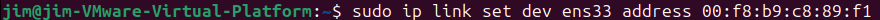
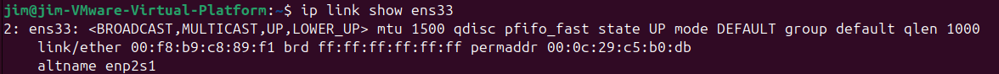
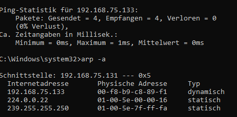

# Linux MAC Adresse ändern 
## Herausfinden welches Netzwerkinterface man ändern will

## Netzwerkinterface deaktivieren

## Ethtool Installieren

Ethtool installiert

## Mac adresse ändern mit Ethtool

Mac adresse geändert auf 0J:1I:2M:48:B5:66

## Netzwerkinterface Aktivieren

## Überprüfung auf dem Ubuntu VM

## Überprüfung Windows Device

## Korigierung wen es nicht funktioniert

