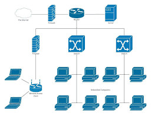

# Aktiv Komponente

## Was ist die primäre Aufgabe der jeweiligen Komponente?
### Switch
Ein Switch verbindet Geräte innerhalb eines Netzwerks und leitet Datenpakete basierend auf MAC-Adressen weiter.
### Router
Ein Router verbindet unterschiedliche Netzwerke und leitet Datenpakete basierend auf IP-Adressen weiter.
### Access Point
Ein Access Point ermöglicht drahtlose Geräteverbindungen zu einem kabelgebundenen Netzwerk.
### Firewall
Eine Firewall schützt Netzwerke vor unautorisiertem Zugriff und Bedrohungen, indem sie den ein- und ausgehenden Datenverkehr filtert.

## Welche Informationen berücksichtigt die jeweilige Komponente bei ihrer primären Tätigkeit?

### Switch 
VLAN-Unterstützung: Teilt ein physisches Netzwerk in mehrere logische Netzwerke.
Port-Security: Verhindert unbefugten Zugriff auf Netzwerkports.
### Router
NAT: Wandelt private IP-Adressen in öffentliche um und umgekehrt.
DHCP: Weist Geräten im Netzwerk automatisch IP-Adressen zu.

### Access Point
SSIDs: Ein Access Point sendet eine oder mehrere SSIDs, um drahtlose Netzwerke zu identifizieren. Beispiel: Ein Access Point sendet die SSID "MeinWLAN", damit Geräte diese für die Verbindung auswählen können.

Roaming: Ermöglicht Geräten die nahtlose Verbindung beim Bewegen zwischen Access Points.

Frequnzbänder: Access Points arbeiten auf bestimmten Frequenzbändern (2.4 GHz, 5 GHz). Beispiel: Ein Access Point arbeitet auf dem 5 GHz-Band, um höhere Datenraten zu bieten und Interferenzen zu vermeiden.

### Firewall 
Stateful Packet Inspection: Überprüft den Zustand von Netzwerkverbindungen.

VPN-Unterstützung: Ermöglicht sichere, verschlüsselte Verbindungen über das Internet.

## Welche Funktionalitäten umfasst die jeweilige Komponente?

### Switch
VLAN-Unterstützung, Port-Security, QoS (Quality of Service), Link Aggregation.

## Welche Protokolle werden von der jeweiligen Komponente berücksichtigt?
### Switch
Ethernet: Basisprotokoll für die Datenübertragung im LAN.

VLAN: Ermöglicht die Trennung des Netzwerkverkehrs in VLANs.

### Router
IP: Hauptprotokoll zur Datenübertragung über Netzwerke.

OSPF: Routing-Protokoll für das Internet.

### Access Point
IEEE: Standards für drahtlose Netzwerke.

WPA/WPA2/WPA3: Sicherheitsprotokolle für die Verschlüsselung von drahtlosen Verbindungen.

### Firewall
TCP/UDP: Kontrolliert Datenverkehr basierend auf diesen Transportprotokollen.

IPsec: Protokoll zur sicheren Kommunikation über IP-Netzwerke

## Welche Bedeutung haben die Begriffe Kollisionsdomäne, Broadcastdomäne und Subnetz in Zusammenhang mit der jeweiligen Komponente?

### Switch
Kollisionsdomäne: Jeder Port des Switches ist eine eigene Kollisionsdomäne, was Kollisionen verringert.

Broadcastdomäne: Alle Ports eines Switches gehören zur selben Broadcastdomäne.

### Router
Kollisionsdomäne: Trennt Kollisionsdomänen und verbessert die Netzwerkleistung.

Broadcastdomäne: Trennt Broadcastdomänen und reduziert den Broadcast-Verkehr.

### Access Point
Kollisionsdomäne: Jede SSID bildet eine eigene drahtlose Kollisionsdomäne.

Broadcastdomäne: Hängt vom verbundenen Netzwerk ab, aber kann Broadcasts über das drahtlose Netzwerk weiterleiten.

### Firewall
Kollisionsdomäne: Kann die Kommunikation zwischen verschiedenen Netzwerken regeln und Kollisionsdomänen trennen.

Broadcastdomäne: Kann Broadcast-Verkehr blockieren oder zulassen, je nach Konfiguration.

## Auf welchem ISO/OSI-Layer & TCP-Layer ist die jeweilige Komponente anzusiedeln und weshalb?
### Switch
OSI Layer 2 (Data Link Layer): Arbeitet mit MAC-Adressen, um Datenpakete innerhalb eines Netzwerks weiterzuleiten.

### Router
OSI Layer 3 (Network Layer): Verwendet IP-Adressen, um Datenpakete zwischen Netzwerken zu leiten.

### Access Point
OSI Layer 2 (Data Link Layer): Funktioniert ähnlich wie ein Switch für drahtlose Verbindungen.

### Firewall
OSI Layer 3/4 (Network/Transport Layer): Filtert Datenverkehr basierend auf IP-Adressen und Ports, kann aber auch auf höheren Schichten arbeiten.

## Welche Symbole werden im Netzwerkplan verwendet, um die jeweilige Komponente abzubilden?

## Welche Informationen sollten im Netzwerkplan zur jeweiligen Komponente miterfasst werden?
### Switch
Anzahl der Ports, VLAN-Konfigurationen, Port-Security-Einstellungen.
### Router
IP-Adressen der Interfaces, Routing-Tabellen, NAT-Konfigurationen.
### Access Point 
SSID, Frequenzbänder, Verschlüsselungsarten.
### Firewall 
Regelwerk, IP-Adressen, Ports, VPN-Endpunkte.